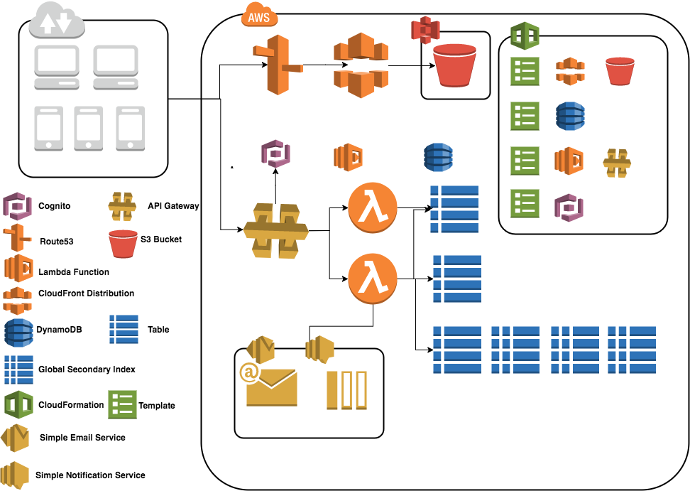

 ##Product Tea in AWS ##

### Applcation ###

1. web app in S3 bucket
2. application deploy in Lambda
3. admin run on laptop

### admin ###

1. DynamoDBConfig
2. S3Bucket

### application ###

1. DynamoDBConfig
2. S3Bucket

### webapp ###

1. auth.js

##### NoSQL Database template name #####

1. shop-order-table.yaml 
2. shop-product-table.yaml
3. cens-user-table.yaml

deploy to aws 

＊＊you need to set the region and credential before deploy

 

** 
user pool for login auth
aws cloudformation deploy --capabilities CAPABILITY_IAM --template-file cens-user.yaml --stack-name cens
aws cloudformation deploy --template-file cens-user-table.yaml --stack-name cens-user-table

**
web 
aws cloudformation deploy --template-file shop-web.yaml --stack-name tea-web
 
** you can change the tamplate name and its details to the name you want to deploy

table with table name
aws cloudformation deploy --template-file shop-product-table.yaml --stack-name tea-product-table
aws cloudformation deploy --template-file shop-order-table.yaml --stack-name tea-order-table

lambda

go to the application folder

gradle build -x test 

Template with related source name

** auth app 

aws cloudformation package --template-file sam-auth.yaml --output-template-file output-sam-auth.yaml --s3-bucket tea-lambda

aws cloudformation deploy --capabilities CAPABILITY_IAM --template-file output-sam-auth.yaml --stack-name tea-auth

** unauth app

aws cloudformation package --template-file sam-un-auth.yaml --output-template-file output-sam-un-auth.yaml --s3-bucket tea-lambda

aws cloudformation deploy --capabilities CAPABILITY_IAM --template-file output-sam-un-auth.yaml --stack-name tea-un-auth

modify table attribute

Order.class OrderKey.class OrderPaidLastKey.class OrderProcessingLastKey.class OrderShippedLastKey.class 

*Product

Product.class ProductKey.class
shop-product-table.yaml

*User
User.class UserKey.class
cens-user-table-yaml

*Price issue

Product.class Order.class
Price.class 

** the attribute mapping for secondary index is related to shop-order-table.yaml
make sure the projection mapping and Order.class are right.

local version

1. download dynamodb local 
 http://docs.aws.amazon.com/amazondynamodb/latest/developerguide/DynamoDBLocal.html#DynamoDBLocal.DownloadingAndRunning
2. add dynamodblocal.jar to project test library